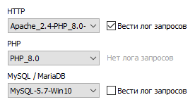

# Интернет-магазин E-shop3

# Инструкция по развертыванию

1. Создать пустую базу данных в MySQL
2. Добавить файл config.local.php в директорию /config со следующим содержимым,
   указав свои данные для подключения к БД:
    ```php
    <?php
    
    return [
        'DB_HOST' => '',
        'DB_USER' => '',
        'DB_PASSWORD' => '',
        'DB_NAME' => '',
    ];
    ```

3. В настройках сервера на вкладке Модули указать следующие параметры:

   HTTP: Apache 2.4 + PHP 8.0 - 8.1

   PHP: 8.0

   MySQL: 5.7

   

4. Запустить встроенный сервер из директории eshop,
   ```
   php -S localhost:8000 -t public
   ```
   
5. Сайт готов к использованию по адресу localhost:8000 (откроется каталог с товарами)

6. После успешного запуска в файле config.php поменять значение 'ENVIRONMENT' на любое другое (например на 'nodev')

7. В таблицу пользователей по умолчанию добавляется администратор (login: admin pass: admin)
